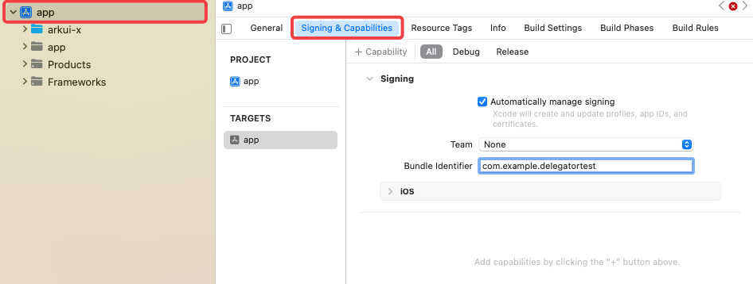
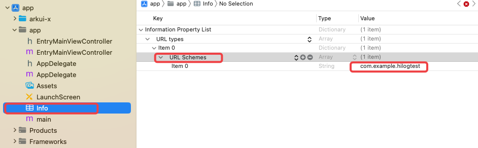
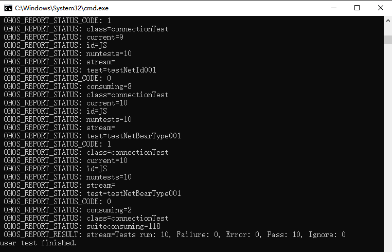

# XTS

## 介绍

XTS是为了保证ArkUI-x提供框架能力在不同平台一致性的测试套件。

## 目录说明

```
├─ ability                               #新框架XTS用例(元能力模块)                               
│  └─ crossplatform                      #跨平台标识
│     └─ ability_runtime                 
│        ├─ contexttest                  #元能力模块contextXTS用例
│        ├─ delegatortest                #元能力模块delegatorXTS用例
│        ├─ lifecycle                    #元能力模块lifecycleXTS用例
│        ├─ commonTestAbilityApp         #元能力模块辅助lifecycle项目
│        └─ uiAbilityLifecycle           #元能力模块uiAbilityLifecycleXTS用例
├─ commonlibrary                         #语言基础库XTS用例
├─ distributeddatamgr                    #数据管理XTS用例
├─ global                                #全球化XTS用例
├─ graphic                               #窗口XTS用例
├─ hiviewdfx                             #DFX XTS用例
├─ storage                               #文件管理XTS用例
├─ request                               #网络管理XTS用例
├─ startup                               #设备管理XTS用例                           
├─ LICENSE                               #LICENSE文件
├─ README-EN.md                          #README-EN文件
├─ README.md                             #README文件
└─ OAT.xml                               #OAT文件    
```

## 用例开发指导

## 创建跨平台工程

创建跨平台工程

- 通过Ace create命令[创建](https://gitee.com/arkui-x/docs/blob/master/zh-cn/application-dev/quick-start/start-with-ace-tools.md#创建应用)跨平台项目，ACE工具使用方法请参见[ACE工具使用指南](https://gitee.com/arkui-x/docs/blob/master/zh-cn/application-dev/quick-start/start-with-ace-tools.md#使用说明)。

跨平台工程目录

- 请参见[应用工程结构说明](https://gitee.com/arkui-x/docs/blob/master/zh-cn/application-dev/quick-start/package-structure-guide.md#android应用工程结构说明)

## 编写测试代码

### 创建测试代码文件

- 进入ohosTest\ets\test目录，创建demo.test.ets文件。测试代码编写可参考创建工程时自动生成的Ability.test.ets中内容。

测试用例采用通用语法，describe定义测试套， it定义测试用例。

| No.  | API        | 功能说明                                                     |
| ---- | ---------- | ------------------------------------------------------------ |
| 1    | describe   | 定义一个测试套，支持两个参数：测试套名称和测试套函数。       |
| 2    | beforeAll  | 在测试套内定义一个预置条件，在所有测试用例开始前执行且仅执行一次，支持一个参数：预置动作函数。 |
| 3    | beforeEach | 在测试套内定义一个单元预置条件，在每条测试用例开始前执行，执行次数与it定义的测试用例数一致，支持一个参数：预置动作函数。 |
| 4    | afterEach  | 在测试套内定义一个单元清理条件，在每条测试用例结束后执行，执行次数与it定义的测试用例数一致，支持一个参数：清理动作函数。 |
| 5    | afterAll   | 在测试套内定义一个清理条件，在所有测试用例结束后执行且仅执行一次，支持一个参数：清理动作函数。 |
| 6    | it         | 定义一条测试用例，支持三个参数：用例名称，过滤参数和用例函数。 |
| 7    | expect     | 支持bool类型判断等多种断言方法。                             |

### 导入依赖模块

在测试文件导入依赖模块，如被测试模块或辅助模块等，如下为导入ohos.util示例。

```js
import { describe, beforeAll, beforeEach, afterEach, afterAll, it, expect } from '@ohos/hypium';
import util from '@ohos.util';

export default function abilityTest() {
  describe('ActsDemoTest', function () {
    ...
  })
}
```

### 编写测试代码

```js
import { describe, beforeAll, beforeEach, afterEach, afterAll, it, expect } from '@ohos/hypium';
import util from '@ohos.util';
export default function UtilFunTest() {
  describe('UtilTest', function () {
    it("testIsNumberObject001", 0, function () {
      let proc = new util.types();
      let result = proc.isNumberObject(new Number(0));
      expect(result).assertEqual(true);
    });

    it("testIsNumberObject002", 0, function () {
      let proc = new util.types();
      let result = proc.isNumberObject(new Number(10));
      expect(result).assertEqual(true);
    });

    it("testIsNumberObject003", 0, function () {
      let proc = new util.types();
      let result = proc.isNumberObject(15);
      expect(result).assertEqual(false);
    });
  })
}
```

| 测试用例编号          | 测试API        | 测试目的                                                   |
| --------------------- | -------------- | ---------------------------------------------------------- |
| testIsNumberObject001 | isNumberObject | 当传入Number对象类型的参数`new Number(0)`时，返回值为true  |
| testIsNumberObject002 | isNumberObject | 当传入Number对象类型的参数`new Number(10)`时，返回值为true |
| testIsNumberObject003 | isNumberObject | 当传入Number类型的参数`15`时，返回值为false                |

### 使用断言

```js
import { describe, it, expect } from '@ohos/hypium';
export default function UtilFunTest() {
  describe('UtilTest', function () {
    it("testIsNumberObject001", 0, function () {
      let proc = new util.types();
      let result = proc.isNumberObject(new Number(0));
      expect(result).assertEqual(true);
    });
  })
}
```

| 测试用例编号          | 测试API        | 测试断言                                                     |
| --------------------- | -------------- | ------------------------------------------------------------ |
| testIsNumberObject001 | isNumberObject | isNumberObject方法传入Number对象类型的参数' new Number(0) '时，返回值为true，使用expect断言result值为true |

- 更多断言使用方式可参考[单元测试框架断言说明](https://gitee.com/openharmony/testfwk_arkxtest#断言库)。

### 修改List.test.ets文件

- 在ohosTest\ets\test\List.test.ets中，导入创建的测试文件

```js
import abilityTest from './Ability.test';

export default function testsuite() {
  abilityTest()
}
```
### 注意事项

- ohosTest\ets\目录中不建议添加除TestAbility之外的新Ability，若有需求，建议使用ace create ability命令在entry目录中创建并测试。

## 执行XTS

- 在所创建工程目录下打开终端，执行测试指令，命令会触发测试工程编译、打包、安装并运行测试用例。

### Android平台XTS执行说明    

- 通过USB连接的Android真机
- 执行测试命令

```
ace test apk --b bundleName --m moduleName --unittest OpenHarmonyTestRunner  --timeout 10000 
示例：
ace test apk --b com.example.demo --m entry_test --unittest OpenHarmonyTestRunner --timeout 10000
```

### iOS平台XTS执行说明

- 配置签名
  使用Xcode打开工程的iOS工程，对项目进行签名。



- 配置openUrl跳转白名单
  使用Xcode打开工程的iOS工程，点击在Info > Information Property List中添加 URL types > URL Schemes中添加项目的实际的bundleName



- 通过USB连接的iOS真机
- 执行测试命令

```
ace test app --b bundleName --m moduleName --unittest OpenHarmonyTestRunner  --timeout 10000
示例：
ace test app --b com.example.demo --m entry_test --unittest OpenHarmonyTestRunner --timeout 10000
```

### 参数说明

- bundleName为AppScope\app.json5文件中的"bundleName"值
- moduleName为ohosTest\module.json5文件中module下定义的"name"值
- unittest为ohosTest\TestRunner下的文件名
- timeout为单条用例执行超时时间，不填默认5000ms。

### 查看测试结果

- 测试执行过程中，上述执行测试用例的窗口会显示测试执行信息。
- 测试结束后，上述执行测试用例的窗口会显示所有的测试结果信息。



其中run表示测试的用例总数，Failure表示测试的用例失败数，Error表示测试的用例错误数，Pass表示测试的用例通过数，Ignore表示测试的用例忽略数。OpenHarmony平台测试用例编写指导方式请见对应[使用指南](https://gitee.com/openharmony/docs/blob/672aed3fd1184490e31b08224119819386a92fc2/zh-cn/application-dev/application-test/arkxtest-guidelines.md)。

## 下一步计划

1.当前跨平台XTS通过日志查看执行结果，需要搭建可视化报告能力